# <center> Experiment 1 : Image classification via convolution nerual network. 
## Environment configuration

### Download the anaconda:
You can download the anaconda ( an open-source package and environment management system ) by clicking [here](https://www.anaconda.com/download/) or visiting the official website https://www.anaconda.com/download/.

Click the <a>Download</a> as the picture to download the anaconda.

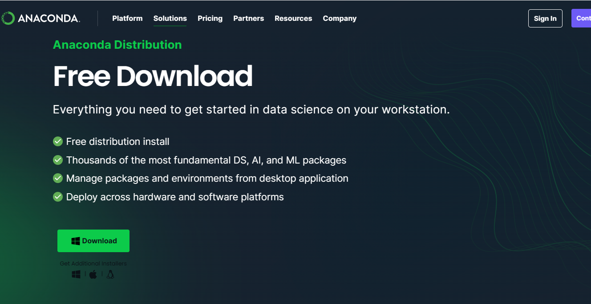

### Install the anaconda:
Click the Next.

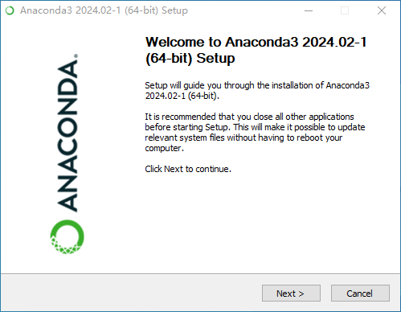

Click the I Agree.

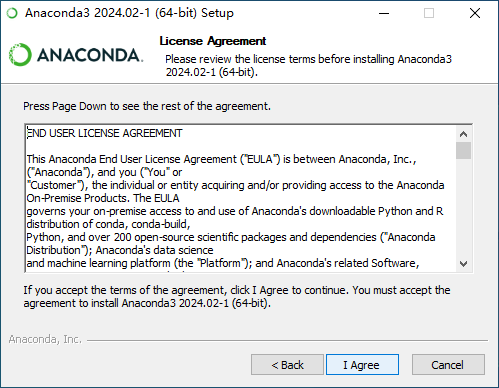

Click the Next.

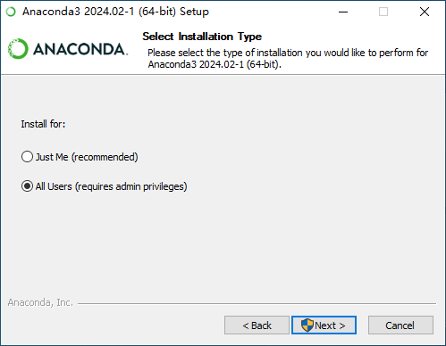

Choose one folder to install the anaconda. Then click the Next.

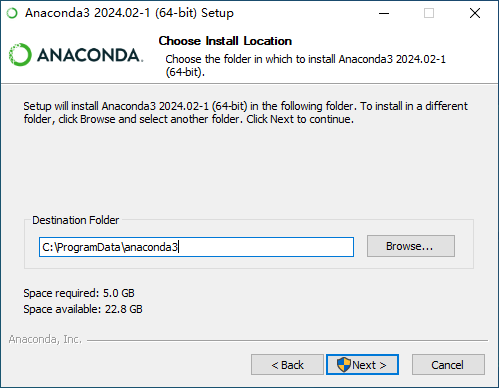

Click the Install.

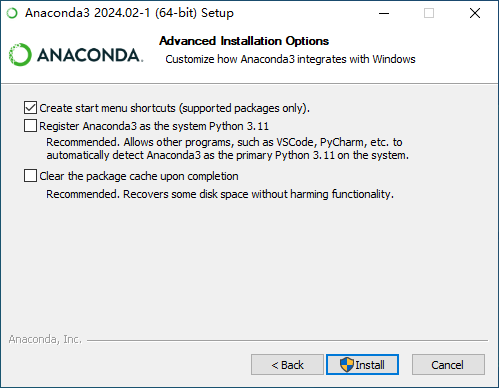

Wait until the anaconda is installed completely.

### Download and insatll Pycharm

Visit the Jetbrains' official website: https://www.jetbrains.com/pycharm/download/?section=windows. Find the Pycharm Community Edition not the Professional and download it. Or you can just click [here](https://download-cdn.jetbrains.com/python/pycharm-community-2024.1.exe).

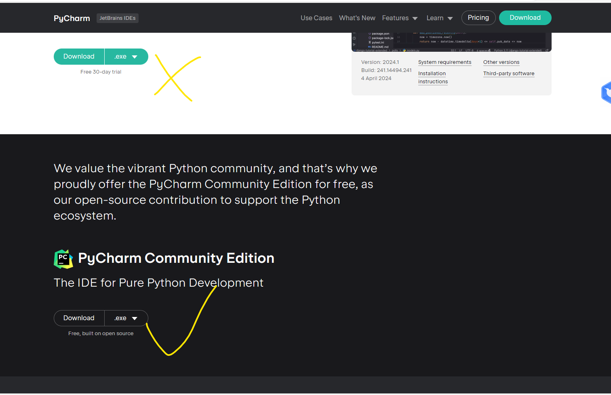

Install the Pycharm (reference from [CSDN](https://blog.csdn.net/qq_44809707/article/details/122501118) ):

Click the Next.

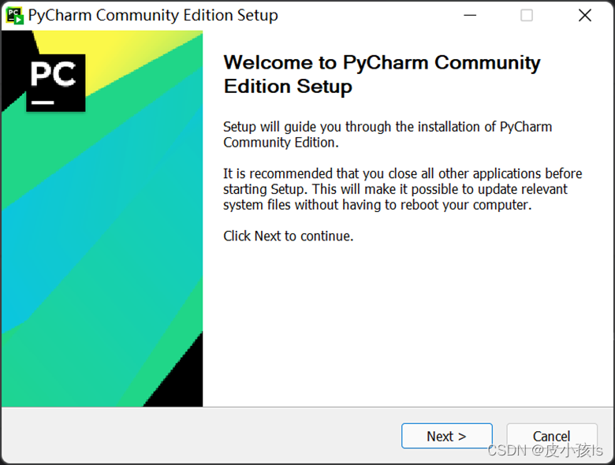

Select one folder to install the Pycharm.

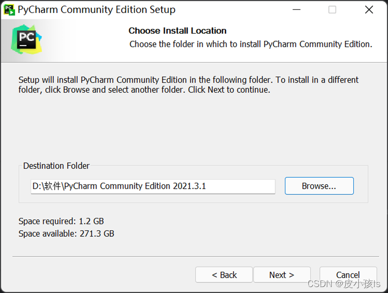

Chosse all and click the Next.

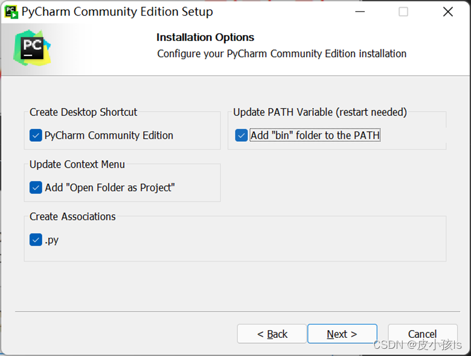

Click the Install.

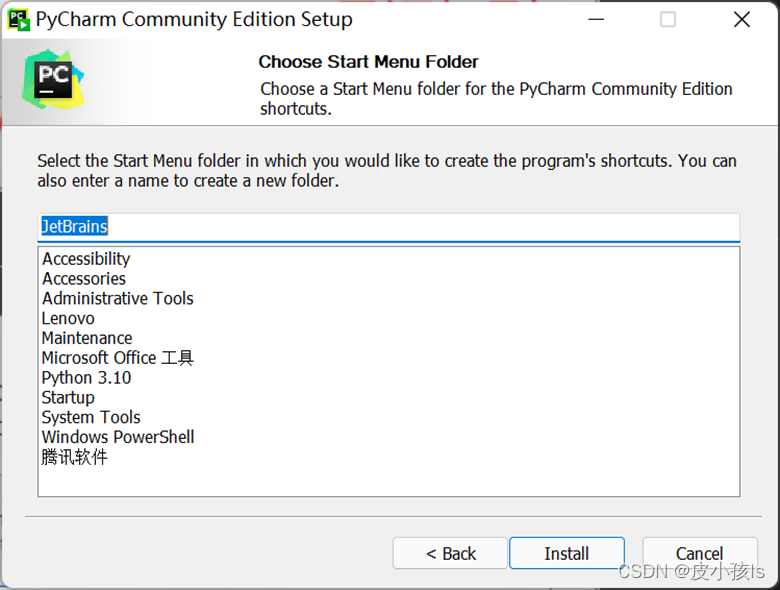

Choose "I want to manually reboot later" and click the Finish.

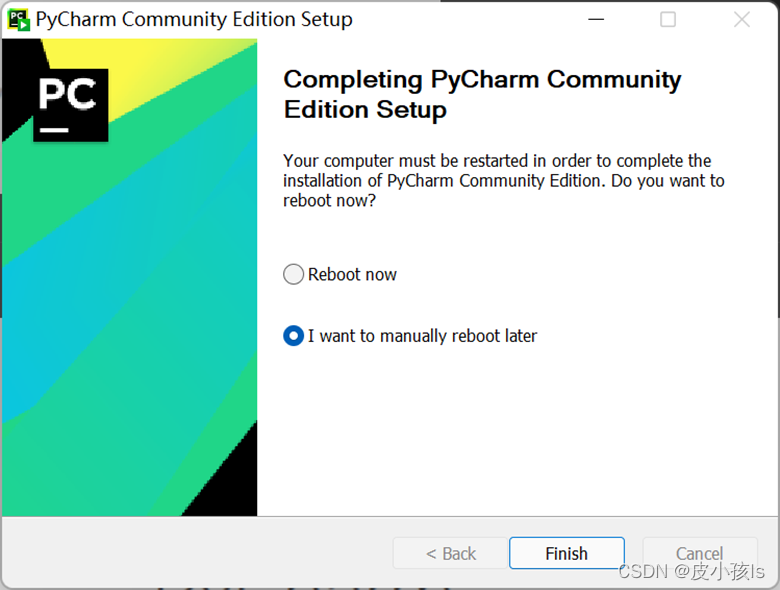

After  installing, open the Pycharm. Click "I confirm that I have read and accept the terms of this User Agreement" and Continue.

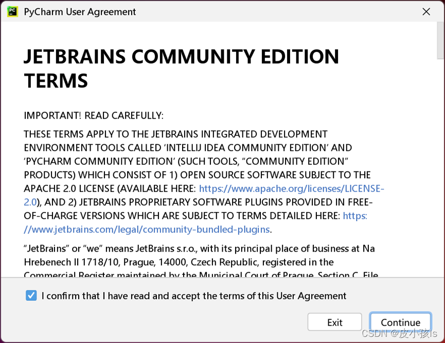

Select the "Don't Send".

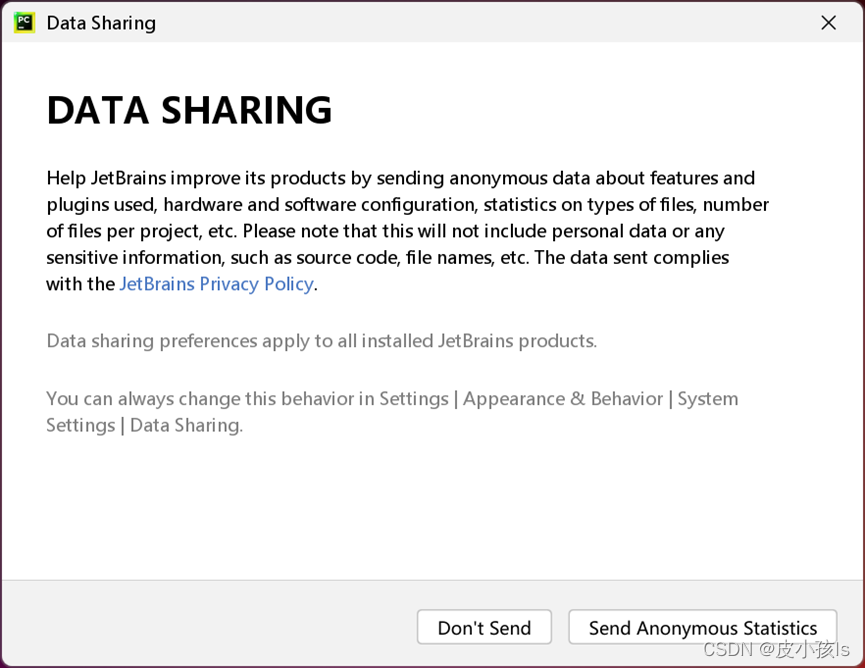

Download this github then click the "Open" and select the folder, or you can create a new project and code. 

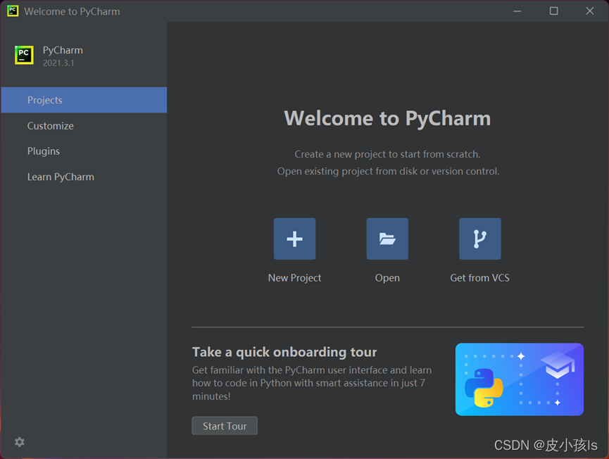

### Create a virtual environment 

Find the Anaconda Powershell Prompt from the "Win" which on the left-botttm of  desktop:

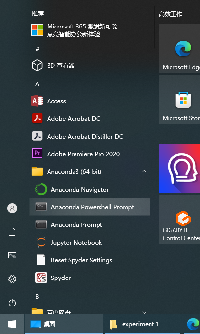

Open the Anaconda Powershell Prompt:

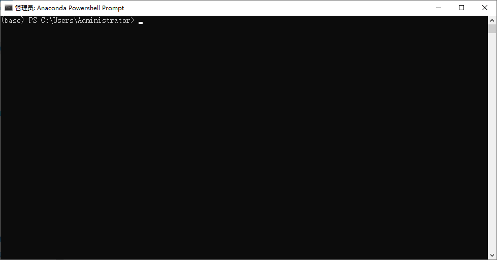

Input the command following to create a virtual environment with python 3.7 (don't use the VPN):

```shell 
conda create -n experiment1 python=3.7 -y
```
Activate the virtual environment and install the torch, torchvision and scipy :
```shell
conda activate experiment1
pip3 install torch torchvision
pip3 install scipy
```
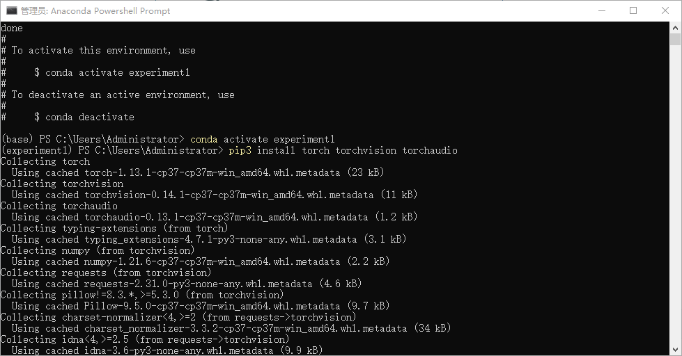

In this experiment we use the CPU-Version torch, but if your computer have the GPU you can install the GPU-Version torch as the guide on the official [torch](https://pytorch.org/) website.

### Select the virtual environment as the main environment of Pycharm

Click the left-top "Main-Menu" or use 'Alt+\'

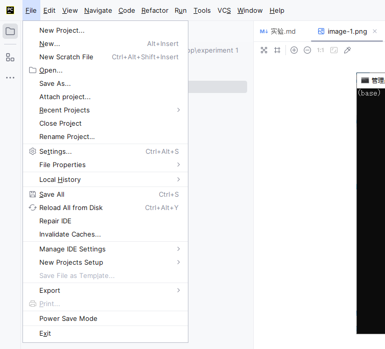

Click the "Settings".

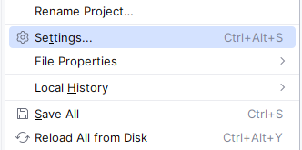

In the Settings, we click the "Project: experiment 1" then click the "Python Interpreter".

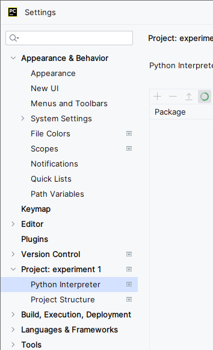

On the right of the settings, click the Add Interpreter then click the "Add Local Interpreter".

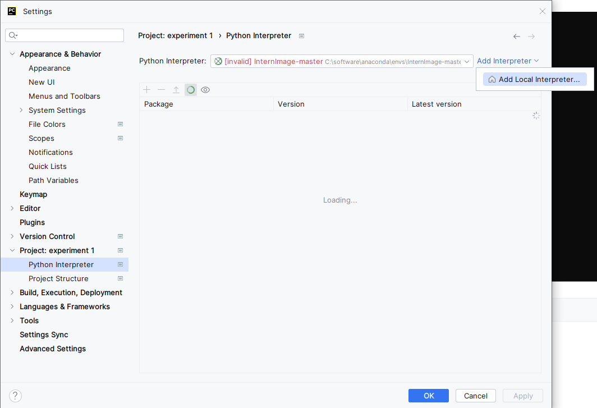

Choose the Conda Environment on the left, and choose the "Use existing environment", then choose the virtual environment "experiment1".

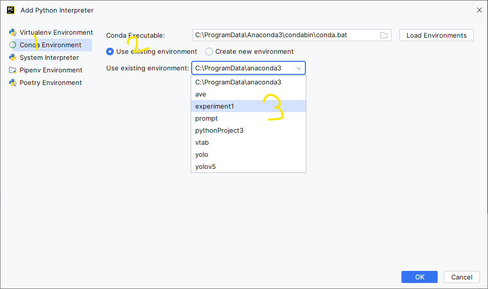

Now you have completed the environment configuration.

## Construct the dataset and dataloader

We choose the [Oxford 102 Flower](https://www.robots.ox.ac.uk/~vgg/data/flowers/102/) as the dataset. The details of this dataset can be seen [here](https://www.robots.ox.ac.uk/~vgg/data/flowers/102/).

Open the [train.py](./train.py) and we are going to code.

import the module we need to use.
```python
import torch
import torchvision
``` 
Build the transfom for the train dataset and test dataset.
```python
train_transform = torchvision.transforms.Compose(
    [torchvision.transforms.Resize([224, 224]),
     torchvision.transforms.ToTensor()])
test_transform = torchvision.transforms.Compose(
    [torchvision.transforms.Resize([224, 224]), torchvision.transforms.ToTensor()])

```
Build the train dataset and test dataset
```python
train_dataset = torchvision.datasets.Flowers102(root='./dataset', split='train', transform=train_transform,
                                                   download=True)
test_dataset = torchvision.datasets.Flowers102(root='./dataset', split='val', transform=test_transform,
                                                  download=True)
```
Build the train dataloader and test dataloader use the two datasets.

```python
from torch.utils.data import DataLoader
train_dataloader=DataLoader(train_dataset,batch_size=128,shuffle=True,drop_last=True)
test_dataloader=DataLoader(test_dataset,batch_size=128,shuffle=True,drop_last=True)
```
Now we have constructed the datasets and dataloaders.

## Build the Convolution Nerual Network
We choose the [ResNet18](https://arxiv.org/abs/1512.03385) as the model. The ResNet serie's  network architectures are shown as following:
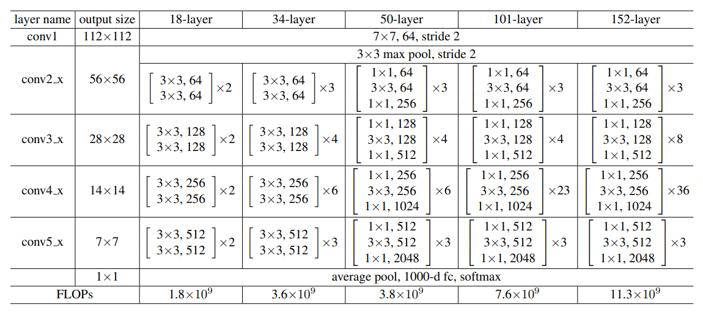

But we can build the resnet18 easily by the torchvision:
```python
model = torchvision.models.resnet18(torchvision.models.ResNet18_Weights)
```
If you are interesting about the implementation of ResNet, you can use 'Ctrl + left mouse button' to click the resnet18( ) above.
## Build the loss function and optimizer
For the Image Classification task, we use the cross-entropy loss function as the loss function and use the SGD(Stochastic Gradient Descent) as the optimizer.
```python
loss_function=torch.nn.CrossEntropyLoss()
optimizer=torch.optim.SGD(model.parameters(),lr=0.005,momentum=0.9)
```

## Code the train function
```python

def train():
    all_loss = 0.0
    n=0
    for data in train_dataloader:
        n=n+1
        optimizer.zero_grad()  # Set 0 into grads of optimizer
        image, target = data  # Fetch the data and target
        output = model(image)  # Forward
        loss = loss_function(output, target)  # Calculate the loss
        loss.backward()  # Backward
        optimizer.step()  # Optimizer works
        all_loss += loss.item()
        print('Train process: %.3f of this epoch, loss : %.2f ' % (n/len(train_dataloader),loss.item()))
    return all_loss / len(train_dataloader)  # return the loss

```
## Code the test function
```python
def test():
    model.eval()  # set the model into the evaluation mode, stopping Backward.
    all_acc = 0.0
    n=0
    for data in test_dataloader:
        n=n+1
        image, target = data  # Fetch the data
        output = model(image)  # Forward
        print('Test process: %.2f of this epoch' % (n / len(test_dataloader)))
        all_acc += torch.eq(torch.argmax(output, dim=-1), target).float().mean()  # Partial accuary
    model.train() # set the model into training mode
    return all_acc / len(test_dataloader)
```
## Code the main function
```python
def main():
    best_acc=0.0
    for i in range(15):  # train for 15 epochs
          # best accuary
        loss = train()
        acc = test()
        print(f"epoch: {i}, loss: {loss}, accuary: {acc}")
        if acc > best_acc:
            torch.save(model, 'best.pth')  # save the best model
            best_acc=acc
if __name__ == '__main__':
    main()

```

Now we have completed the all codes, now we need to run the code.

## Run the code 

Open the train.py in Pycharm, then you can run the code by clicking the "Run" button on the top
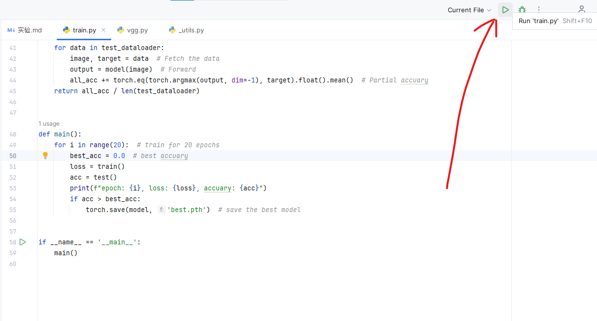, 
or you can run the code in the terminal by inputing following command and press the "Enter" : 
```shell
python train.py
```
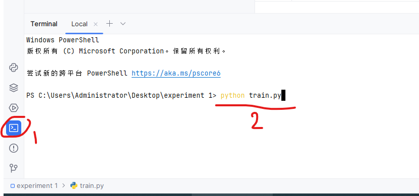

## Homework
You need to improve the accuary of the Image Classification task to more than 75% just by modifying the code instead of rewriting the code all.
There are two things you need to submit: 1 Your code modified based on the code we provided. 2 Screenshot of the experimental results and the accuary must be more than 75%.

Hints: You can experiment with different learning rates, use the weight decay, use data augmentation and use the scheduler to change the learning rates during training the model.
